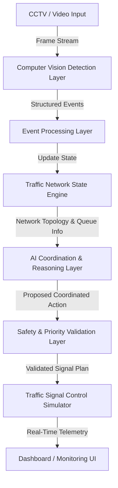

# SyncSignal — Emergency-Aware, Self-Healing Traffic Signal Network

SyncSignal is an intelligent, agent-based traffic signal orchestration network designed to observe urban traffic events, share state across neighboring intersections, resolve competing priority conflicts, and execute coordinated traffic signal responses safely.

---

## 🚨 Problem

Traditional traffic signals operate as isolated, static timer units or rudimentary loop-detector triggers. They lack situational awareness across adjacent intersections and are unaware of multi-modal priority hierarchies.

* **Emergency Delays:** Ambulances and fire engines get blocked at red lights, losing critical seconds during emergency responses.
* **Vulnerable Road User Exposure:** Pedestrians, cyclists, children, and elderly citizens face rigid countdown timers that do not extend during crowded crossings.
* **Isolated Intersections:** Incident congestion at one intersection cascades into surrounding blocks because adjacent signals cannot dynamically adapt their green waves.
* **Single-Point Conflict Resolution:** When an emergency vehicle approaches an intersection where a severe accident or wanted vehicle alert is active, traditional systems cannot intelligently evaluate competing safety priorities.

---

## 💡 Solution

SyncSignal transforms traffic signals into an intelligent, interconnected network of self-healing agents. Intersections continuously exchange queue density and event status with neighbors, evaluate priority hierarchies, and coordinate dynamically:

1. **Observe Traffic Events:** Detect emergency vehicles, accidents, pedestrians, wanted vehicles, public transit, and congestion surges via vision and event feeds.
2. **Share Network State:** Maintain real-time topology and queue information across neighboring intersections ($I_1 \leftrightarrow I_2 \leftrightarrow I_3 \leftrightarrow I_4$).
3. **Autonomous AI Reasoning:** Compute optimal multi-intersection green waves and corridor overrides using open-weight LLMs via Featherless API.
4. **Deterministic Safety Validation:** Every AI decision is filtered through an uncompromising safety validator before any signal modification is authorized.
5. **Simulate & Visualize:** Provide traffic operators with live monitoring dashboards and automated signal overrides.

---

## 🧠 Key Innovation

SyncSignal is **not** just a "CCTV + Object Detector" demo.

The true innovation lies in the tight coupling of computer vision event detection with multi-agent network state coordination, AI-driven contextual reasoning, explicit conflict resolution, and deterministic safety enforcement.

```
Computer Vision
       ↓
Network State Sharing ($I_1 \leftrightarrow I_2 \dots$)
       ↓
Autonomous AI Contextual Reasoning (Featherless API)
       ↓
Priority & Conflict Resolution
       ↓
Deterministic Safety Layer (Hard-Rule Validation)
       ↓
Multi-Intersection Green Wave Signal Override
```

---

## 🏗️ Core Architecture



### Safety Architecture Principle

> **Critical Safety Rule:** The Large Language Model (LLM) NEVER directly controls traffic signals.
> The AI reasoning engine proposes a coordinated traffic plan, which MUST be evaluated and authorized by a deterministic safety validator before reaching signal controllers. If an AI proposal violates minimum yellow clearance times or creates conflicting green signals, the safety layer rejects the decision and enforces fail-safe signal timing.

---

## 🏆 Priority Hierarchy

When multiple events occur simultaneously across the network, SyncSignal resolves conflicts according to an explicit, non-negotiable priority hierarchy:

| Priority Rank | Level Identifier | Description & System Action |
| :--- | :--- | :--- |
| **Priority 1 (Highest)** | `EMERGENCY_VEHICLE` | Preempt signals for active ambulances, fire engines, and rescue vehicles to create clear green corridors. |
| **Priority 2** | `VULNERABLE_ROAD_USER` | Extend pedestrian crossing phases for crowds, elderly pedestrians, or wheelchairs to ensure zero casualties. |
| **Priority 3** | `WANTED_VEHICLE` | Coordinate red light traps and police containment grids for flagged suspect vehicles. |
| **Priority 4** | `ACCIDENT` | Lock down crashed lanes, route incoming traffic away, and clear incoming emergency access lanes. |
| **Priority 5** | `TRANSIT` | Grant green-extension priority to delayed high-capacity public buses and light rail. |
| **Priority 6** | `SURGE_CORRIDOR` | Optimize green waves for VIP motorcades or mass-evacuation traffic surges. |

---

## 🛠️ Technology Stack

### Backend Infrastructure (Implemented in Step 1)
* **Python 3.10+ & FastAPI:** High-performance asynchronous API framework and event routing.
* **Pydantic v2:** Rigorous data modeling for network topology, signal phases, and event payloads.
* **Deterministic Safety Validator Stub:** Enforces yellow timing and conflicting green rules.

### Planned Backend Extensions (Future Steps)
* **WebSockets (Planned):** Low-latency bidirectional event broadcasting to the monitoring UI.
* **SQLite (Planned):** Light embedded datastore for persistent incident logs and signal audits.
* **Ultralytics YOLO v8 (Planned):** Object detection for vehicles, pedestrians, buses, and emergency transport.
* **OpenCV (Planned):** Video processing pipeline and frame extraction.
* **Featherless API (Planned):** Hosting open-weight LLMs (e.g. Llama 3.1 70B Instruct) for context-aware multi-intersection traffic reasoning.

### Frontend Dashboard (Implemented in Step 1)
* **React 18 & Vite:** Modern single-page dashboard application.
* **Official ITMS Command Center Theme:** Professional Indian Smart Cities Intelligent Traffic Management System command dashboard styling.
* **Leaflet.js (Planned):** Interactive geo-referenced map visualization of intersection networks.

---

## 🗺️ Project Development Roadmap & Phase Status

- [x] **Step 1 — Foundation & Architecture (Current Implementation)**
  - Project directory structure setup.
  - FastAPI backend initialization with CORS, logging, and health endpoints.
  - Data models for Intersections, Connected Topologies ($I_1 \leftrightarrow I_2 \leftrightarrow I_3 \leftrightarrow I_4$), Signal States, and Priority Hierarchies.
  - Modular service stubs for Safety Validation, AI Reasoning, and CV Detection.
  - Professional Indian ITMS Command Center dashboard interface shell with Network Overview cards, Topology Map Canvas, Event Monitor Table, and Signal Telemetry cards.
  - Centralized Priority Hierarchy configuration.
- [ ] **Phase 1 (Planned):** Real-Time Signal Coordination, Queue Sharing, Green-Wave Logic & Interactive Map.
- [ ] **Phase 2 (Planned):** Camera-Based Emergency Vehicle Corridor Detection & Preemption.
- [ ] **Phase 3 (Planned):** ANPR / Watchlist Criminal Vehicle Containment Grid.
- [ ] **Phase 4 (Planned):** Automatic Incident Detection, Severity Estimation & Dynamic Rerouting.
- [ ] **Phase 5 (Planned):** Vulnerable Road User Detection & Dynamic Pedestrian Crossing Extensions.
- [ ] **Phase 6 (Planned):** Public / Mass Transit Priority Scheduling.
- [ ] **Phase 9 (Planned):** VIP / Mass Evacuation Surge Corridor Preemption.

---

## 🚀 Running the Project

### Prerequisites
* **Python 3.10+**
* **Node.js 18+ & npm**

### 1. Environment Setup

Copy `.env.example` to create your local `.env`:

```bash
cp .env.example .env
```

### 2. Backend Setup & Launch

```bash
# Navigate to backend directory
cd backend

# Create virtual environment (optional but recommended)
python -m venv venv
# On Windows:
venv\Scripts\activate
# On Linux/macOS:
source venv/bin/activate

# Install dependencies
pip install -r requirements.txt

# Run the FastAPI development server
uvicorn app.main:app --reload --port 8000
```

Verify backend health at: [http://localhost:8000/api/health](http://localhost:8000/api/health)

### 3. Frontend Setup & Launch

```bash
# Navigate to frontend directory
cd frontend

# Install dependencies
npm install

# Run Vite dev server
npm run dev
```

Open dashboard at: [http://localhost:5173](http://localhost:5173)

---

## 📁 Project Directory Structure

```
NexGenX/
├── .env.example            # Environment variables template
├── .gitignore              # Git ignore rules
├── README.md               # System architecture & documentation
├── backend/
│   ├── requirements.txt    # Python dependencies
│   └── app/
│       ├── __init__.py
│       ├── main.py         # FastAPI application entrypoint
│       ├── config.py       # Priority constants & environment configuration
│       ├── api/            # API endpoints
│       │   ├── __init__.py
│       │   ├── health.py   # System health-check endpoint
│       │   ├── intersections.py # Sample network topology endpoints
│       │   └── priority.py # Priority hierarchy endpoints
│       ├── models/         # Pydantic domain models
│       │   ├── __init__.py
│       │   ├── intersection.py # Intersection & Signal State schemas
│       │   └── priority.py    # Priority hierarchy enum & rules
│       └── services/       # Core architectural modules
│           ├── __init__.py
│           ├── ai_coordinator.py    # Featherless API integration stub
│           ├── cv_detector.py       # YOLO/OpenCV vision pipeline stub
│           ├── event_processor.py   # Event router stub
│           └── safety_validator.py  # Deterministic safety rule engine stub
└── frontend/
    ├── package.json
    ├── vite.config.js
    ├── index.html
    └── src/
        ├── main.jsx
        ├── App.jsx         # Main dashboard layout wrapper & ticker bar
        ├── index.css       # Official Indian ITMS Command Center dark theme
        └── components/     # UI Dashboard Components
            ├── Header.jsx              # Official ITMS brand & system status bar
            ├── NetworkOverview.jsx     # Executive metrics overview cards
            ├── TrafficNetworkMap.jsx   # GIS schematic topology canvas
            ├── EventMonitor.jsx        # Real-time incident table feed container
            └── SignalStatus.jsx        # Telemetry cards for intersection signal states
```
